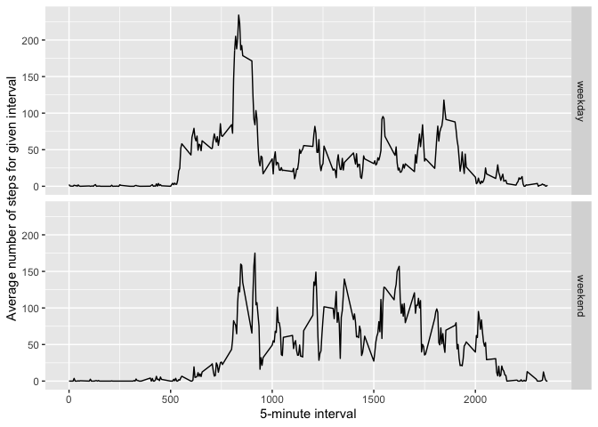

## Loading and preprocessing the data

### Load the data

```r
library(dplyr)
```

```
## Warning: package 'dplyr' was built under R version 4.0.1
```

```
## 
## Attaching package: 'dplyr'
```

```
## The following objects are masked from 'package:stats':
## 
##     filter, lag
```

```
## The following objects are masked from 'package:base':
## 
##     intersect, setdiff, setequal, union
```

```r
unzip("activity.zip",exdir="data")
data<-read.csv("data/activity.csv", stringsAsFactors=FALSE)
```
#### A quick look at the data

```r
str(data)
```

```
## 'data.frame':	17568 obs. of  3 variables:
##  $ steps   : int  NA NA NA NA NA NA NA NA NA NA ...
##  $ date    : chr  "2012-10-01" "2012-10-01" "2012-10-01" "2012-10-01" ...
##  $ interval: int  0 5 10 15 20 25 30 35 40 45 ...
```

```r
summary(data)
```

```
##      steps            date              interval     
##  Min.   :  0.00   Length:17568       Min.   :   0.0  
##  1st Qu.:  0.00   Class :character   1st Qu.: 588.8  
##  Median :  0.00   Mode  :character   Median :1177.5  
##  Mean   : 37.38                      Mean   :1177.5  
##  3rd Qu.: 12.00                      3rd Qu.:1766.2  
##  Max.   :806.00                      Max.   :2355.0  
##  NA's   :2304
```

### Process/transform the data into a format suitable for analysis
#### Convert the date from a character to date format

```r
library(lubridate)
```

```
## Warning: package 'lubridate' was built under R version 4.0.2
```

```
## 
## Attaching package: 'lubridate'
```

```
## The following objects are masked from 'package:base':
## 
##     date, intersect, setdiff, union
```

```r
data$date<-ymd(data$date)
```
#### A quick look to see the change

```r
str(data)
```

```
## 'data.frame':	17568 obs. of  3 variables:
##  $ steps   : int  NA NA NA NA NA NA NA NA NA NA ...
##  $ date    : Date, format: "2012-10-01" "2012-10-01" ...
##  $ interval: int  0 5 10 15 20 25 30 35 40 45 ...
```

## What is mean total number of steps taken per day?
##### Ignore the missing values in the dataset

### Calculate the total number of steps taken per day

```r
stepsperday<-data%>%filter(!is.na(steps))%>%group_by(date)%>%summarise(steps=sum(steps))
```

```
## `summarise()` ungrouping output (override with `.groups` argument)
```

### Make a histogram of the total number of steps taken each day

```r
hist(stepsperday$steps,col="aquamarine2",breaks=40,main="Total Number of Steps Taken Per Day",xlab="# of steps taken per day",ylab="# of days")
```

<!-- -->

### Calculate and report the mean and median of the total number of steps taken per day

```r
meanwithNA<-mean(stepsperday$steps)
medianwithNA<-median(stepsperday$steps)
```
Mean: 1.0766189\times 10^{4}
Median: 10765

## What is the average daily activity pattern?

### Make a time series plot of the 5-minute interval and the average number of steps taken, averaged across all days

```r
library(dplyr)
library(ggplot2)
timeplotsteps<-aggregate(x=list(steps=data$steps), by=list(interval=data$interval),FUN=mean, na.rm=TRUE)
ggplot(data=timeplotsteps,aes(x=interval,y=steps))+geom_line()+ylab("Average number of steps for given interval")+xlab("5-minute interval")
```

<!-- -->

### Which 5-minute interval, on average across all the days in the dataset, contrains the maximum number of steps?

```r
higheststeps<-timeplotsteps[which.max(timeplotsteps$steps),]
```
With 206.1698113 average steps, interval 835 contains the maximum number of steps

## Imputing missing values
##### Note that there are a number of days/intervals where there are missing values. The presence of missing days may introduce bias into some calculations or summaries of the data.

### Calculate and report the total number of missing values in the dataset

```r
NAamount<-sum(is.na(data$steps))
```
The number of missing values in the dataset is 2304

### Devise a strategy for filling in all of the missing values in the dataset.
To fill in the missing values in the dataset, we can use the average number of steps in each 5-minute interval to impute into the missing values.

### Create a new dataset that is equal to the original dataset but with the missing data filled in

```r
fillNA<-numeric(nrow(data))
for (i in 1:nrow(data)){
    if(is.na(data[i,"steps"])==TRUE){
        fillNA[i]<-filter(timeplotsteps,interval==data[i,"interval"])%>%select(steps)
        }
    else{
        fillNA[i]<-data[i,"steps"]
    }
}
noNAdata<-mutate(data,noNAsteps=fillNA)
```
#### A quick look to see the change

```r
head(noNAdata)
```

```
##   steps       date interval noNAsteps
## 1    NA 2012-10-01        0  1.716981
## 2    NA 2012-10-01        5 0.3396226
## 3    NA 2012-10-01       10 0.1320755
## 4    NA 2012-10-01       15 0.1509434
## 5    NA 2012-10-01       20 0.0754717
## 6    NA 2012-10-01       25   2.09434
```

### Make a histogram of the total number of steps taken each day and calculate and report the mean and median total number of steps taken per day. Do these values differ from the estimates from the first part of the assignment? What is the impact of imputing missing data on the estimates of the total daily number of steps?

```r
stepsperday_noNA<-noNAdata%>%mutate(noNAsteps=as.numeric(noNAsteps))%>%group_by(date)%>%summarise(allsteps=sum(noNAsteps))
```

```
## `summarise()` ungrouping output (override with `.groups` argument)
```

```r
hist(stepsperday_noNA$allsteps,col="chocolate2",breaks=40,main="Total Number of Steps Taken Per Day",xlab="# of steps taken per day",ylab="# of days")
```

<!-- -->

```r
noNAmean<-mean(stepsperday_noNA$allsteps)
noNAmedian<-median(stepsperday_noNA$allsteps)
```
Mean filling the NAs:1.0766189\times 10^{4}
Median filling the NAs: 1.0766189\times 10^{4}

Reminder from the first part of the assignment:
Mean with NAs: 1.0766189\times 10^{4}
Median with NAs: 10765
#### Quick look at the data summaries with or without NAs 

```r
summary(stepsperday_noNA$allsteps)
```

```
##    Min. 1st Qu.  Median    Mean 3rd Qu.    Max. 
##      41    9819   10766   10766   12811   21194
```

```r
summary(stepsperday$steps)
```

```
##    Min. 1st Qu.  Median    Mean 3rd Qu.    Max. 
##      41    8841   10765   10766   13294   21194
```
The mean and median do not change by filling in the NAs. None of the other summary metrics change drastically either. By inputting the missing data on the estimates, we have generated more data points, but have not skewed the data in any particular direction.

## Are there differences in activity patterns between weekdays and weekends?

### Create a new factor variable in the dataset with two levels - "weekday" and "weekend" indicating whether a given date is a weekday or weekend day

```r
noNAdata$daytype<-ifelse(as.POSIXlt(noNAdata$date)$wday%in%c(0,6),"weekend","weekday")
```

### Make a panel plot containing a time series plot of the 5-minute interval and the average number of steps taken, averaged across all weekday days or weekend days

```r
averagednoNAdata<-aggregate(steps~interval+daytype,data=noNAdata,mean)
ggplot(data=averagednoNAdata,aes(x=interval,y=steps))+geom_line()+ylab("Average number of steps for given interval")+xlab("5-minute interval")+facet_grid(daytype~.)
```

<!-- -->
